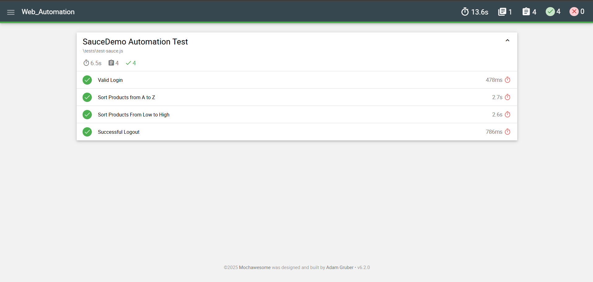

# 🧪 SauceDemo Automation Test

Project ini adalah bagian dari **Digital Skola kelas QA Engineer batch 10**.  
Dalam project ini berisikan **automated testing** pada situs [SauceDemo](https://www.saucedemo.com) menggunakan **Selenium WebDriver** dan **Mocha** sebagai framework testing, dengan fokus pada fungsionalitas login, sorting produk, dan logout.

---

## 📦 Teknologi yang Digunakan

- ✅ [Node.js]
- ✅ [Mocha]
- ✅ [Selenium WebDriver]

---

## 🧪 Daftar Pengujian

| No | Nama Test                                       | Deskripsi                                                                 |
|----|-------------------------------------------------|--------------------------------------------------------------------------|
| 1  | `Sukses Login`                                  | Memastikan pengguna bisa login dengan kredensial yang benar              |
| 2  | `Urutkan Produk dari A ke Z`                    | Menguji fitur sorting berdasarkan nama produk secara alfabetis (A-Z)     |
| 3  | `Urutkan Produk dari Harga Terendah ke Tertinggi` | Menguji fitur sorting berdasarkan harga dari termurah ke termahal     |
| 4  | `Sukses Logout`                                 | Memastikan pengguna bisa logout dengan benar dari menu navigasi         |

---

## ▶️ Cara Menjalankan

### 1. Install dependensi:
```bash
npm install
```

### 2. Jalankan semua pengujian:
```bash
npm run test
```
> Ini akan menjalankan seluruh file di dalam folder `tests/` dan menghasilkan **report otomatis** dalam format HTML.

---

## 📊 Hasil Test Report (Mochawesome)

Berikut adalah **hasil visual** dari pengujian otomatis:




---

## 👨‍💻 Author

Rifqi Abdillah – [GitHub](https://github.com/rfqabdillah)