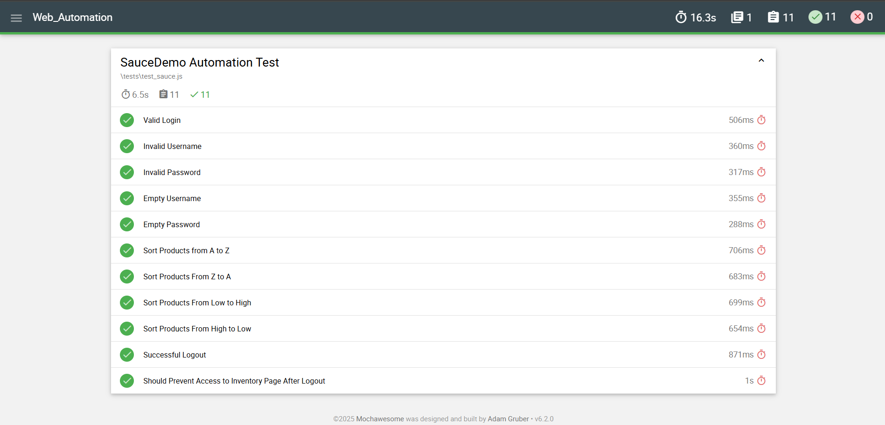

# 🧪 SauceDemo Automation Test

Project ini adalah bagian dari **Digital Skola kelas QA Engineer batch 10**.  
Dalam project ini berisikan **automation testing** pada situs [SauceDemo](https://www.saucedemo.com) menggunakan **Selenium WebDriver** dan **Mocha** sebagai framework testing, dengan fokus pada fungsionalitas login, sorting produk, dan logout.

---

## 📦 Teknologi yang Digunakan

- ✅ [Node.js]
- ✅ [Mocha]
- ✅ [Selenium WebDriver]

---

## 📝 Dokumen Terkait
📄 [Test Plan](https://docs.google.com/document/d/1-4MzljIhisdSCkjLXwHUiBB9qCDiHFmwdOPdATWi5PA/edit?tab=t.0)
✅ [Test Case](https://docs.google.com/spreadsheets/d/19kYuJgQ020JsNfxKsuvpyLHNXHUVHZ1NFBa7C4a-Co0/edit?gid=1241190217#gid=1241190217)
🐞 [Bug Report](https://docs.google.com/spreadsheets/d/19kYuJgQ020JsNfxKsuvpyLHNXHUVHZ1NFBa7C4a-Co0/edit?gid=857509039#gid=857509039)

---

## 🧪 Daftar Pengujian

| No | Nama Test                                         | Deskripsi                                                                 |
|----|--------------------------------------------------|--------------------------------------------------------------------------|
| 1  | `Sukses Login`                                    | Memastikan pengguna bisa login dengan kredensial yang benar              |
| 2  | `Username Salah`                                  | Menampilkan error ketika username salah                                  |
| 3  | `Password Salah`                                  | Menampilkan error ketika password salah                                  |
| 4  | `Username Kosong`                                 | Menampilkan error ketika username tidak diisi                            |
| 5  | `Password Kosong`                                 | Menampilkan error ketika password tidak diisi                            |
| 6  | `Urutkan Produk dari A ke Z`                      | Menguji fitur sorting berdasarkan nama produk secara alfabetis (A-Z)     |
| 7  | `Urutkan Produk dari Z ke A`                      | Menguji fitur sorting nama dari Z ke A                                   |
| 8  | `Urutkan Produk dari Harga Terendah ke Tertinggi` | Menguji fitur sorting harga dari termurah ke termahal                    |
| 9  | `Urutkan Produk dari Harga Tertinggi ke Terendah` | Menguji fitur sorting harga dari termahal ke termurah                    |
| 10 | `Sukses Logout`                                   | Memastikan pengguna dapat logout dengan benar dari menu navigasi         |
| 11 | `Redirect ke Halaman Login setelah Logout`        | Memastikan user diarahkan kembali ke halaman login setelah logout        |
| 12 | `Cegah Akses Inventory setelah Logout`            | Memastikan user tidak bisa akses `/inventory.html` setelah logout        |

---

## ▶️ Cara Menjalankan

### 1. Install dependensi:
```bash
npm install
```

### 2. Jalankan semua pengujian:
```bash
npm run test
```
> Ini akan menjalankan seluruh file di dalam folder `tests/` dan menghasilkan **report otomatis** dalam format HTML.

---

## 📊 Hasil Test Report (Mochawesome)

Berikut adalah **hasil visual** dari pengujian otomatis:




---

## 👨‍💻 Author

Rifqi Abdillah – [GitHub](https://github.com/rfqabdillah)